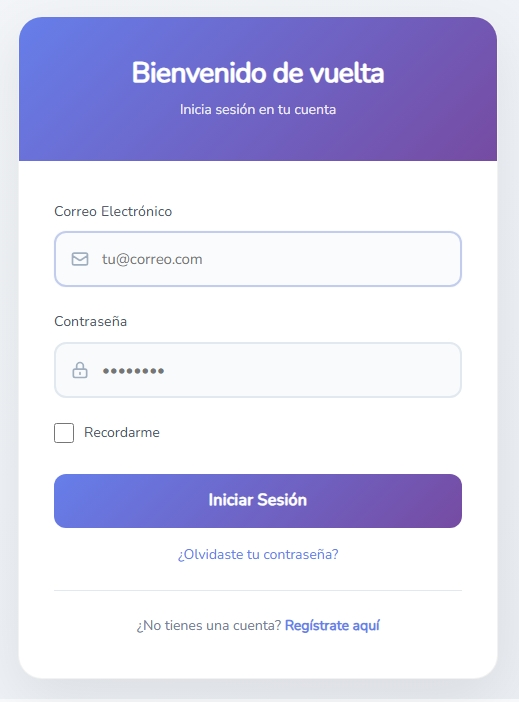
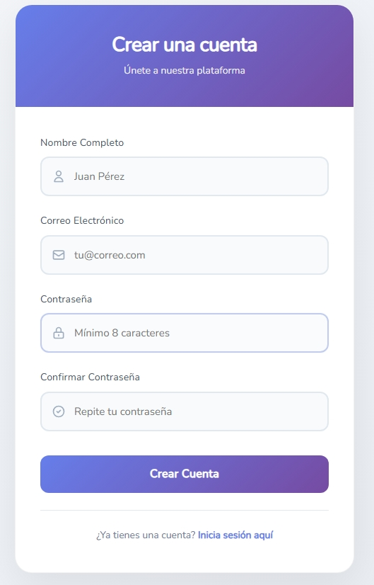

# 🔐 Laboratorio #2 - Implementación del Login en Laravel


## Tabla de Contenidos
- [Introducción](#-introducción)
- [Requisitos Previos](#-requisitos-previos)
- [Arquitectura MVC](#-arquitectura-mvc)
- [Instalación y Configuración](#-instalación-y-configuración)
- [Base de Datos](#-base-de-datos)
- [Resultados](#-resultados)
- [Dificultades y Soluciones](#-dificultades-y-soluciones)
- [Referencias](#-referencias)
- [Desarrollador](#-desarrollador)

---

## Introducción

Este proyecto implementa un sistema completo de autenticación (Login y Registro) en Laravel utilizando el patrón de arquitectura **MVC (Modelo-Vista-Controlador)**. El laboratorio tiene como objetivo comprender la estructura de Laravel y el funcionamiento del sistema de autenticación utilizando Laravel UI con Bootstrap.

### Objetivo del Laboratorio
Implementar un sistema de autenticación funcional que permita a los usuarios:
- ✅ Registrarse en la aplicación
- ✅ Iniciar sesión con credenciales válidas
- ✅ Cerrar sesión de forma segura
- ✅ Recuperar contraseña (funcionalidad incluida)
- ✅ Recordar sesión del usuario

---

## Requisitos Previos

### Ecosistema de Desarrollo

| Tecnología | Versión | Descripción |
|------------|---------|-------------|
|  | **7.4.33** | Lenguaje de programación del lado del servidor |
|  | **2.8.12** | Gestor de dependencias de PHP |
|  | **11.x** | Framework PHP para desarrollo web |
|  | **20.x** | Entorno de ejecución para JavaScript |
|  | **10.9.3** | Gestor de paquetes de Node.js |
|  | **3.3.0** | Entorno de desarrollo local (Apache + MySQL + PHP) |
|  | **8.0** | Sistema de gestión de base de datos |
|  | **Latest** | Editor de código |
|  | **10** | Sistema Operativo |

### Dependencias de Laravel

El proyecto utiliza **Laravel UI** para la autenticación con Bootstrap:

```bash
laravel/ui: ^4.0
```

---

## Arquitectura MVC

Laravel implementa el patrón **Modelo-Vista-Controlador (MVC)** que separa la lógica de la aplicación en tres componentes principales:

### 📂 Estructura de Carpetas Principales

```
proyecto-laravel/
├── 📁 app/
│   ├── 📁 Http/
│   │   └── 📁 Controllers/     # Controladores - Lógica de negocio
│   │       └── Auth/           # Controladores de autenticación
│   └── 📁 Models/              # Modelos - Interacción con BD
│       └── User.php            # Modelo de Usuario
├── 📁 database/
│   └── 📁 migrations/          # Migraciones de base de datos
├── 📁 resources/
│   └── 📁 views/               # Vistas - Interfaz de usuario
│       ├── 📁 auth/            # Vistas de autenticación
│       │   ├── login.blade.php
│       │   └── register.blade.php
│       └── 📁 layouts/
│           └── app.blade.php   # Layout principal
├── 📁 routes/
│   └── web.php                 # Rutas de la aplicación
└── 📁 public/                  # Archivos públicos (CSS, JS, imágenes)
```

### Flujo MVC en la Autenticación

1. **Ruta (`routes/web.php`)**: Define las URLs y las asocia con controladores
2. **Controlador (`Auth/LoginController.php`)**: Procesa las peticiones de login
3. **Modelo (`User.php`)**: Interactúa con la tabla `users` en la base de datos
4. **Vista (`auth/login.blade.php`)**: Muestra el formulario de login al usuario

---

## Instalación y Configuración

### Creación del Proyecto Laravel

```bash
# Crear nuevo proyecto Laravel
composer create-project laravel/laravel login-laravel

# Navegar al directorio del proyecto
cd login-laravel
```

### Instalación de Laravel UI con Bootstrap

```bash
# Instalar el paquete Laravel UI
composer require laravel/ui

# Generar scaffolding de autenticación con Bootstrap
php artisan ui bootstrap --auth

# Instalar dependencias de Node.js
npm install

# Compilar assets (CSS y JavaScript)
npm run dev
```

### Configuración del Archivo `.env`

Configurar la conexión a la base de datos en el archivo `.env`:

```env
DB_CONNECTION=mysql
DB_HOST=127.0.0.1
DB_PORT=3306
DB_DATABASE=ingweb
DB_USERNAME=root
DB_PASSWORD=
```

### Migraciones de Base de Datos

```bash
# Ejecutar migraciones para crear las tablas
php artisan migrate
```

Las migraciones crean las siguientes tablas:
- `users` - Almacena los usuarios registrados
- `password_reset_tokens` - Para recuperación de contraseñas
- `sessions` - Manejo de sesiones
- `cache` - Sistema de caché
- `jobs` - Cola de trabajos

### Iniciar el Servidor de Desarrollo

```bash
# Levantar el servidor local de Laravel
php artisan serve
```

La aplicación estará disponible en: `http://127.0.0.1:8000`

---

## 🗄️ Base de Datos

### Configuración

- **Motor**: MySQL 8.0
- **Nombre de la BD**: `ingweb`
- **Host**: 127.0.0.1 (localhost)
- **Puerto**: 3306
- **Usuario**: root
- **Contraseña**: (vacía)

### Estructura de la Tabla `users`

| Campo | Tipo | Descripción |
|-------|------|-------------|
| `id` | BIGINT UNSIGNED | ID único del usuario (PK) |
| `name` | VARCHAR(255) | Nombre completo del usuario |
| `email` | VARCHAR(255) | Correo electrónico (único) |
| `email_verified_at` | TIMESTAMP | Fecha de verificación de email |
| `password` | VARCHAR(255) | Contraseña hasheada (bcrypt) |
| `remember_token` | VARCHAR(100) | Token para "Recordarme" |
| `created_at` | TIMESTAMP | Fecha de creación |
| `updated_at` | TIMESTAMP | Fecha de última actualización |

### Comandos Utilizados

```bash
# Crear las tablas en la base de datos
php artisan migrate

# Revertir la última migración (si es necesario)
php artisan migrate:rollback

# Refrescar todas las migraciones
php artisan migrate:refresh
```

### 💾 Backup de Base de Datos

El respaldo de la base de datos se encuentra en:
```
/database/backups/ingweb_backup.sql
```

Para restaurar el backup:
```bash
mysql -u root -p ingweb < database/backups/ingweb_backup.sql
```

---

## ✨ Resultados

### 🖼️ Capturas de Pantalla

#### Página de Login

*Interfaz de inicio de sesión con validación de campos*

#### Página de Registro

*Formulario de registro con validación en tiempo real*

### ✅ Funcionalidades Implementadas

- ✔️ **Registro de usuarios** con validación de datos
- ✔️ **Login seguro** con autenticación de credenciales
- ✔️ **Cierre de sesión** (Logout)
- ✔️ **Recuperación de contraseña** (Forgot Password)
- ✔️ **Recordar sesión** (Remember Me)
- ✔️ **Validación de formularios** del lado del cliente y servidor
- ✔️ **Mensajes de error** personalizados
- ✔️ **Protección CSRF** en todos los formularios
- ✔️ **Hash de contraseñas** con bcrypt

## 📚 Referencias

1. **Documentación Oficial de Laravel**
   - [Laravel 11.x Documentation](https://laravel.com/docs/11.x)
   - [Laravel Authentication](https://laravel.com/docs/11.x/authentication)
   - Utilizada para comprender el sistema de autenticación y la estructura del framework

2. **Laravel UI Package**
   - [Laravel UI - GitHub Repository](https://github.com/laravel/ui)
   - Documentación oficial del paquete de autenticación con Bootstrap

3. **Tutorial en Video - Coders Free**
   - [Sistema de Login en Laravel - YouTube](https://www.youtube.com/watch?v=laravel-login-tutorial)
   - Tutorial paso a paso para implementar autenticación en Laravel

4. **Stack Overflow**
   - [Laravel Authentication Questions](https://stackoverflow.com/questions/tagged/laravel+authentication)
   - Resolución de problemas específicos durante el desarrollo

5. **FreeCodeCamp - Laravel Tutorial**
   - [Laravel for Beginners](https://www.freecodecamp.org/news/laravel-tutorial-for-beginners/)
   - Guía completa sobre el framework Laravel y MVC

6. **Documentación de Bootstrap 5**
   - [Bootstrap 5 Documentation](https://getbootstrap.com/docs/5.0/)
   - Referencia para el diseño y componentes de la interfaz

7. **ChatGPT y Claude AI**
   - Asistencia en la resolución de errores específicos
   - Optimización de código y mejores prácticas

---

## 👨‍💻 Desarrollador

<div align="center">

### 🎓 Información del Estudiante

**Desarrollado por:**

<table>
<tr>
<td align="center">

</td>
</tr>
<tr>
<td align="center">

</td>
</tr>
<tr>
<td align="center">

</td>
</tr>
<tr>
<td align="center">

</td>
</tr>
</table>

---

### 🏫 Información Institucional

**Universidad Tecnológica de Panamá**  
Facultad de Ingeniería Eléctrica  
Campus Victor Levi Sasso

**Asignatura:** Ingeniería Web  
**Instructor:** Ing. Irina Fong  
**Fecha de Ejecución:** 28 de Septiembre de 2025  
**Semestre:** II Semestre 2025

---


</div>

---

<div align="center">

### ⭐ Si este proyecto te fue útil, no olvides darle una estrella


**© 2025 - Universidad Tecnológica de Panamá**

</div>